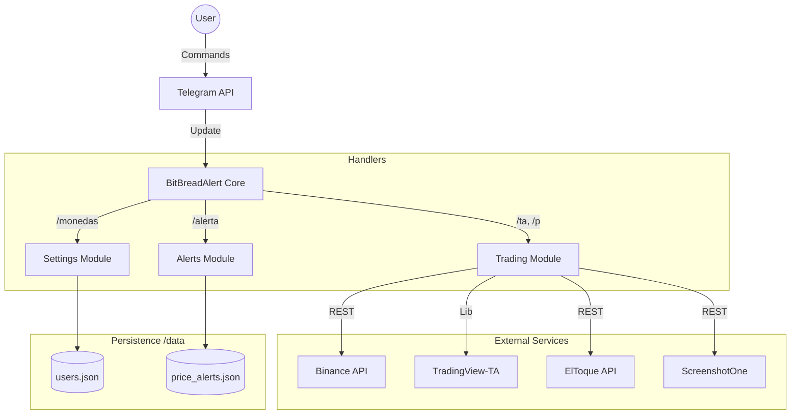
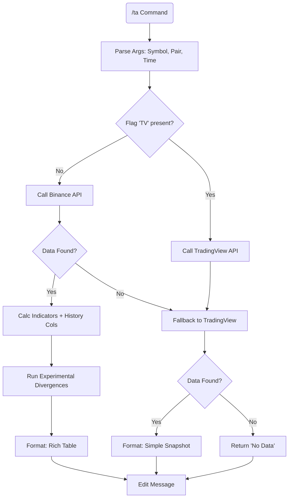

# 📄 BitBreadAlert: Technical Whitepaper & User Manual

## 1\. Executive Summary

**BitBreadAlert** is an asynchronous Telegram bot engineered for real-time cryptocurrency monitoring. Unlike standard price checkers, BitBreadAlert utilizes a **hybrid architecture** combining **periodic portfolio reports** (cron-based) with **event-driven alerts** (threshold triggers). It features specialized integrations for the **Hive** ecosystem (HBD peg stability) and the Cuban informal exchange market (**ElToque**), alongside advanced Technical Analysis (TA) tools.

-----

## 2\. User Guide: Commands & Modules

### 2.1. Initialization

  * **/start**: Registers the user in the database. The bot automatically detects the user's language (ES/EN).
  * **/lang**: Manually toggles the interface language.

### 2.2. Module A: Portfolio Monitoring (Periodic)

The core monitoring engine allows users to define a custom list of assets and a reporting frequency.

  * **/monedas `<COINS>`**: Sets the watchlist.
      * *Usage:* `/monedas BTC, HIVE, ETH`
  * **/temp `<HOURS>`**: Sets the reporting interval.
      * *Usage:* `/temp 2.5` (Sends a report every 2.5 hours).
  * **/ver**: Forces an immediate execution of the portfolio report, bypassing the timer.

### 2.3. Module B: Event-Driven Alerts (Triggers)

Triggers that fire *only* when specific market conditions are met.

  * **/alerta `<COIN> <PRICE>`**: Sets a price crossing alert.
      * *Usage:* `/alerta BTC 95000`
      * *Logic:* Creates dual triggers (Upper/Lower). Whichever is crossed first fires the notification and consumes the alert.
  * **/misalertas**: Displays active triggers with interactive buttons to delete them.

### 2.4. Module C: Market Analysis & Tools

#### 📊 Advanced Technical Analysis (`/ta`)

The `/ta` command performs a real-time technical analysis using a fallback system between Binance (Historical Data) and TradingView (Snapshot).

  * **Syntax:** `/ta <SYMBOL> [PAIR] [TIMEFRAME] [TV]`
  * **Smart Argument Parsing:**
      * *Default:* `/ta BTC` $\rightarrow$ Analyzes BTC/USDT on 1h timeframe via Binance.
      * *Custom Pair:* `/ta BTC ETH` $\rightarrow$ Analyzes BTC/ETH.
      * *Custom Time:* `/ta BTC 4h` $\rightarrow$ Analyzes BTC/USDT on 4h.
      * *Force Source:* `/ta BTC TV` $\rightarrow$ Forces data from **TradingView** (bypassing Binance).
  * **Output Modes:**
    1.  **Binance Mode (Rich Data):** Provides historical context (Current | Prev | Prev-2) for indicators like RSI, MFI, CCI, and Pivots. Includes **Experimental** divergence detection.
    2.  **TradingView Mode (Snapshot):** Used as a fallback or forced option. Provides current indicator values without historical columns.
  * **Indicators:** RSI, MACD, Bollinger Bands, ATR, OBV, Williams %R, Momentum, ADX, and PSAR.

#### 📉 Other Market Tools

  * **/graf `<COIN> [PAIR] <TIME>`**: Generates a chart screenshot.
      * *Usage:* `/graf BTC ETH 4h` (Returns an image from TradingView charts).
  * **/p `<COIN>`**: detailed ticker information (Price, Vol, Cap, 24h% Change).
  * **/mk**: **Global Market Status**. Checks opening/closing times of major stock exchanges (NYC, London, Tokyo, etc.) relative to UTC.
  * **/tasa**: Fetches informal exchange rates (USD, MLC, EUR) from the **ElToque API** with trend indicators.

-----

## 3\. Technical Architecture

### 3.1. Core Components

The bot is built on `python-telegram-bot` (v20+) using `asyncio` for non-blocking operations.

  * **Event Loop:** Manages concurrent tasks (API calls, listeners).
  * **JobQueue:** Handles scheduled tasks (User Reports).
  * **Background Loops:** Independent `asyncio` tasks for high-frequency monitoring.

### 3.2. Data Flow & Logic Diagrams

#### A. High-Level Architecture (Mermaid)

Data flow from user input to external APIs and storage.

#### B. Technical Analysis Logic (`/ta` Flow)

Decision tree for the smart analysis command.

#### C. The Loop System

Three concurrent monitoring processes defined in `loops.py`.

1.  **HBD Monitor (High Freq):** Checks Hive Backed Dollar peg stability every \~5 mins. Broadcasts to subscribers if thresholds are breached.
2.  **Custom Alert Loop (Med Freq):** Batches all user price alerts, fetches unique coin prices in a single API call, and triggers individual notifications.
3.  **User JobQueue (Low Freq):** Individual timers for portfolio reports.

-----

## 4\. Administration & Monetization

### 4.1. Ad Injection System

The bot includes an `ads_manager.py` that injects text-based advertisements into high-traffic responses (`/p`, `/ta`, `/ver`).

  * **/ad add `<TEXT>`**: Adds a new ad to the rotation.
  * **/ad del `<INDEX>`**: Removes an ad.

### 4.2. Admin Commands

Restricted to IDs listed in `ADMIN_CHAT_IDS`.

| Command | Usage | Description |
| :--- | :--- | :--- |
| **/ms** | `/ms` | **Broadcast Wizard:** Interactive conversation to send text/media to ALL users safely. |
| **/users** | `/users` | **Analytics:** Displays total users, active retention, and top watched coins. |
| **/logs** | `/logs` | **System Health:** Retrieves the last 50 lines of the runtime log. |
| **/tasaimg** | `/tasaimg` | **Dynamic Image:** Generates a `.png` summary of ElToque rates using `Pillow` and sends it. |
| **/hbdalerts** | `/hbdalerts` | **Peg Control:** interactive menu to Add/Delete/Pause/Resume HBD price thresholds. |

-----

## 5\. External Integrations & libraries

  * **pandas & pandas\_ta:** Heavy-duty data manipulation and indicator calculation for `/ta` (Binance mode).
  * **tradingview\_ta:** API wrapper for scraping TradingView technical ratings.
  * **ScreenshotOne:** API for server-side rendering of chart screenshots.
  * **ElToque:** Custom integration with retry logic and caching for Cuban market data.
  * **Pillow (PIL):** Used in `image_generator.py` for drawing data over image templates.