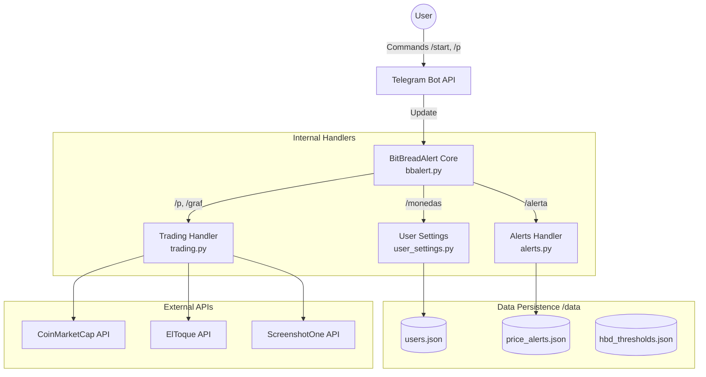

# 📄 BitBreadAlert: Technical Whitepaper & User Manual

## 1. Executive Summary
**BitBreadAlert** is an asynchronous Telegram bot designed for real-time cryptocurrency monitoring. Unlike standard price bots, BitBreadAlert offers a hybrid approach: it combines **periodic portfolio reports** (user-defined intervals) with **event-driven alerts** (price crossing targets). It features specialized integration for the **Hive** ecosystem (HBD stability monitoring) and the Cuban informal exchange market (**ElToque**).

---

## 2. User Guide: How to use the Bot
*For the general user, the bot operates on three main pillars: Portfolio Monitoring, Target Alerts, and Market Tools.*

### 2.1. Getting Started
* **Initialization:** Send `/start` to register. The bot automatically detects the user's language (Spanish/English) but defaults to Spanish if unsure.
* **Language:** Users can manually switch languages using `/lang`.

### 2.2. Pillar A: The "Watchlist" (Periodic Reports)
This is the bot's "heartbeat." Users define a list of coins and a frequency, and the bot sends a summary automatically.

* **Step 1: Define Coins:**
    * Command: `/monedas BTC, HIVE, ETH`
    * *Action:* Sets the list of assets the user wants to track.
* **Step 2: Set Frequency:**
    * Command: `/temp 2.5` (Example for 2.5 hours).
    * *Action:* The bot will send a report of the defined coins every 2.5 hours.
* **Step 3: Instant Check:**
    * Command: `/ver`
    * *Action:* Ignores the timer and shows the current prices of the watchlist immediately.

### 2.3. Pillar B: Target Alerts (Price Crossing)
Users can set specific triggers that fire *only* when a price condition is met.

* **Set Alert:** `/alerta <COIN> <PRICE>`
    * *Example:* `/alerta BTC 95000`
    * *Logic:* The bot creates two hidden triggers: one if BTC goes *above* 95k, and one if it drops *below* 95k. Whichever happens first triggers the notification.
* **Manage Alerts:** `/misalertas` shows active triggers with buttons to delete them.

### 2.4. Pillar C: Specialized Market Tools
* **Charts:** `/graf <COIN> <TIMEFRAME>` (e.g., `/graf BTC 1h`). Returns a screenshot of the TradingView chart.
* **Detailed Price:** `/p <COIN>`. Shows price, volume, market cap, and change vs BTC/ETH.
* **Cuban Exchange Rate (ElToque):** `/tasa`. Connects to the ElToque API to fetch informal exchange rates (USD/CUP, MLC, etc.) with trend indicators.

---

## 3. Technical Architecture (Internal Logic)

### 3.1. The Asynchronous Core
The bot is built on `python-telegram-bot` (v20+) using `asyncio`. It handles high concurrency without blocking using a non-blocking JobQueue.

### 3.2. The Loop System (Background Tasks)
The bot runs three concurrent monitoring processes in `loops.py`:

1.  **The User JobQueue (Personalized):**
    * *Logic:* When a user sets `/temp`, a unique `Job` is scheduled in the application's `JobQueue`.
    * *Flow:* Every $X$ hours $\rightarrow$ Fetch user's coin list $\rightarrow$ Call API $\rightarrow$ Send Message.

2.  **The Custom Alert Loop (`check_custom_price_alerts`):**
    * *Frequency:* Runs every `INTERVALO_CONTROL` (approx. 8 mins).
    * *Efficiency:* It loads all active alerts into memory. It fetches prices for *all* unique coins in one API call (to save API credits) rather than one call per user.
    * *Trigger:* Compares `Current_Price` vs `Target_Price` vs `Previous_Memory_Price`. If a crossover is detected, it notifies the user and deletes the alert.

3.  **The HBD Monitor (`alerta_loop`):**
    * *Frequency:* High frequency (every `INTERVALO_ALERTA`, approx. 5 mins).
    * *Purpose:* Monitors the HBD (Hive Backed Dollar) peg.
    * *Logic:* It compares the current HBD price against an Admin-defined list of thresholds (e.g., $0.95, $1.05). If a threshold is crossed, it broadcasts a message to *all* users who subscribed via `/hbdalerts`.

### 3.3. Data Persistence
The bot uses a lightweight JSON-based database system located in the `/data` folder:
* `users.json`: Stores User IDs, language preferences, watchlists, and alert intervals.
* `price_alerts.json`: Stores active target alerts (Coin, Target, Condition).
* `hbd_thresholds.json`: Stores the "tripwires" for the HBD peg alerts.
* `ads.json`: Stores text ads injected into bot messages.

### 3.4. External Integrations
* **CoinMarketCap:** Primary source for crypto prices and metadata.
* **ElToque API:** Source for Cuban informal market rates (includes retry logic for reliability).
* **ScreenshotOne:** Renders HTML/TradingView widgets into images for the `/graf` command.

---

## 4. Admin & Monetization Features

### 4.1. Advertisement Injection
The bot includes an `ads_manager.py`. Admins can add text ads.
* *Logic:* Every time a user requests a price check (`/p`), a report (`/ver`), or receives an alert, the bot injects a random ad from the JSON database at the bottom of the message.

### 4.2. Administration
* **Logs:** Admins can view the last 45 internal log lines via `/logs` directly in Telegram.
* **Broadcasting:** Admins can define HBD thresholds dynamically using `/hbdalerts add <price> run`.

---

## 5. Conclusion
BitBreadAlert is a robust, low-maintenance solution for crypto tracking. Its architecture separates "Personal/Periodic" monitoring from "Event/Trigger" monitoring, ensuring users are informed both regularly and instantly when market conditions change. The inclusion of localized tools (ElToque) and niche ecosystem tools (HBD) makes it uniquely valuable compared to generic price bots.

---

### 1\. 🏗️ System Architecture Diagrams

These diagrams visualize how the different components of `BitBreadAlert` interact. You can include these in the **"3. Technical Architecture"** section of your paper.

#### A. High-Level Data Flow (Mermaid)

This diagram shows how a user request travels through the bot to external APIs and databases.

#### B. The Loop System (Mermaid)

This diagram illustrates the three concurrent background processes defined in `loops.py` and how they trigger notifications.

```mermaid
sequenceDiagram
    participant Timer
    participant LoopHBD as HBD Monitor (Loop)
    participant LoopCustom as Custom Alerts (Loop)
    participant JobQ as User JobQueue
    participant Users

    Note over Timer, LoopHBD: Every ~5 min (INTERVALO_ALERTA)
    Timer->>LoopHBD: Check HBD Price
    LoopHBD->>LoopHBD: Compare vs Thresholds
    alt Threshold Crossed
        LoopHBD->>Users: 🚨 SEND HBD ALERT (Broadcast)
    end

    Note over Timer, LoopCustom: Every ~8 min (INTERVALO_CONTROL)
    Timer->>LoopCustom: Check "Target" Alerts
    LoopCustom->>LoopCustom: Fetch Prices for ALL active coins
    LoopCustom->>LoopCustom: Check Price vs Target
    alt Condition Met
        LoopCustom->>Users: 🔔 SEND PRICE ALERT (Individual)
        LoopCustom->>LoopCustom: Delete Alert
    end

    Note over Timer, JobQ: User Defined (e.g., 2.5h)
    Timer->>JobQ: Trigger "User_Alert_Job"
    JobQ->>JobQ: Load User's Coin List
    JobQ->>Users: 📊 SEND PERIODIC REPORT
```

-----

### 2\. 🛡️ Admin Cheat Sheet

This section is strictly for users whose Telegram ID is listed in `ADMIN_CHAT_IDS` in `config.py`. These commands allow you to manage the bot without accessing the server terminal.

#### 📢 Broadcasting & HBD Management

| Command | Usage | Description | Source File |
| :--- | :--- | :--- | :--- |
| **/hbdalerts** | `/hbdalerts add <price>` | **Add Alert:** Adds a new price tripwire.  *Ex: `/hbdalerts add 0.95`* | `user_settings.py` |
| | `/hbdalerts del <price>` | **Delete Alert:** Removes an existing tripwire. | |
| | `/hbdalerts edit <price> stop`| **Pause Alert:** Keeps the threshold but stops checking it. | |
| | `/hbdalerts edit <price> run` | **Resume Alert:** Re-activates a paused threshold. | |
| **/ms** | `/ms` (Start conversation) | **Broadcast Message:** Starts a wizard to send a message to **ALL** registered users. Follow the bot's prompts. | `handlers/admin.py`\* |

#### 🛠️ System & Debugging

| Command | Usage | Description | Source File |
| :--- | :--- | :--- | :--- |
| **/users** | `/users` | **User Stats:** Shows total registered users and active database stats. | `handlers/admin.py`\* |
| **/logs** | `/logs` | **View Logs:** Displays the last \~45 lines of the internal system log (errors, startup events). | `handlers/admin.py`\* |
| **/ad** | `/ad <text>` | **Add Ad:** Adds a new text ad to the rotation. | `handlers/admin.py`\* |
| **/tasaimg**| `/tasaimg` | **ElToque Image:** (Likely) Generates/Sends a visual summary of the exchange rates. | `handlers/admin.py`\* |

> **Note:** The `*` indicates that the handler is imported in `bbalert.py` but the file content wasn't fully visible in the upload. However, the command registration confirms their existence.

#### 🚨 Automatic Admin Notifications

The bot will automatically DM all admins in these events:

1.  **Bot Restart:** When `bbalert.py` initializes (includes Version & PID).
2.  **API Failure:** If critical APIs (like ElToque) fail repeatedly after retries.