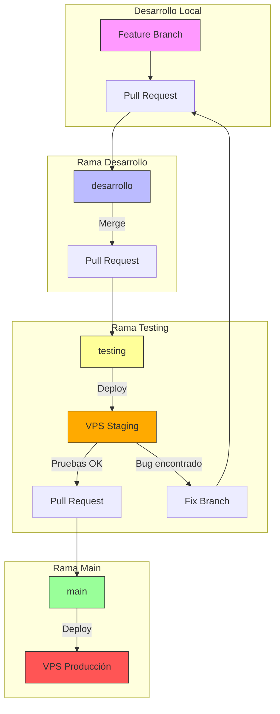

# Flujo de Trabajo Git - BBAlert

## Diagrama del Flujo de Trabajo



## Estructura de Ramas

| Rama | Propósito | Protección |
|------|-----------|------------|
| `main` | Código en producción | Requiere PR aprobado + 1 review |
| `testing` | Código en staging para pruebas | Requiere PR desde desarrollo |
| `desarrollo` | Integración de features | Requiere PR desde feature branch |
| `feature/*` | Desarrollo de nuevas funcionalidades | Sin protección |

## Flujo de Trabajo Paso a Paso

### 1. Crear una nueva funcionalidad

```bash
# Crear rama feature desde desarrollo
git checkout desarrollo
git pull origin desarrollo
git checkout -b feature/nueva-funcionalidad

# Desarrollar y hacer commits
git add .
git commit -m "feat: agregar nueva funcionalidad"

# Subir rama
git push origin feature/nueva-funcionalidad
```

### 2. Merge a desarrollo

1. Crear Pull Request en GitHub: `feature/nueva-funcionalidad` → `desarrollo`
2. Esperar aprobación (si aplica)
3. Hacer merge del PR

### 3. Despliegue a testing

```bash
# Crear PR: desarrollo → testing
# Hacer merge del PR

# En el VPS
~/scripts/deploy-staging.sh
sudo systemctl restart bbalert-staging
```

### 4. Pruebas en staging

- Verificar que el bot funciona correctamente
- Probar las nuevas funcionalidades
- Verificar que no hay regresiones

### 5. Si hay bugs

```bash
# Crear rama fix desde desarrollo
git checkout desarrollo
git checkout -b fix/corregir-bug

# Corregir y hacer commit
git commit -m "fix: corregir bug encontrado en staging"

# Crear PR a desarrollo y repetir el proceso
```

### 6. Merge a main (producción)

```bash
# Crear PR: testing → main
# Hacer merge del PR

# En el VPS
~/scripts/deploy-prod.sh
sudo systemctl restart bbalert-prod
```

## Resumen de Comandos Frecuentes

| Acción | Comando |
|--------|---------|
| Crear feature | `git checkout -b feature/nombre desarrollo` |
| Actualizar rama | `git pull origin nombre-rama` |
| Subir cambios | `git push origin nombre-rama` |
| Ver estado | `git status` |
| Ver ramas | `git branch -a` |
| Cambiar rama | `git checkout nombre-rama` |

## Convenciones de Commits

Usamos [Conventional Commits](https://www.conventionalcommits.org/):

- `feat:` - Nueva funcionalidad
- `fix:` - Corrección de bug
- `docs:` - Cambios en documentación
- `style:` - Cambios de formato (no afectan código)
- `refactor:` - Refactorización de código
- `test:` - Agregar/modificar tests
- `chore:` - Tareas de mantenimiento
- `infra:` - Cambios de infraestructura

## Manejo de Conflictos

Si hay conflictos durante un merge:

1. Git marcará los archivos en conflicto
2. Editar los archivos para resolver los conflictos
3. `git add <archivos-resueltos>`
4. `git commit` (para completar el merge)

## Rollback

Si es necesario revertir cambios:

```bash
# Revertir un commit específico
git revert <commit-hash>

# Crear rama desde un commit anterior
git checkout -b rollback-branch <commit-hash>
```
