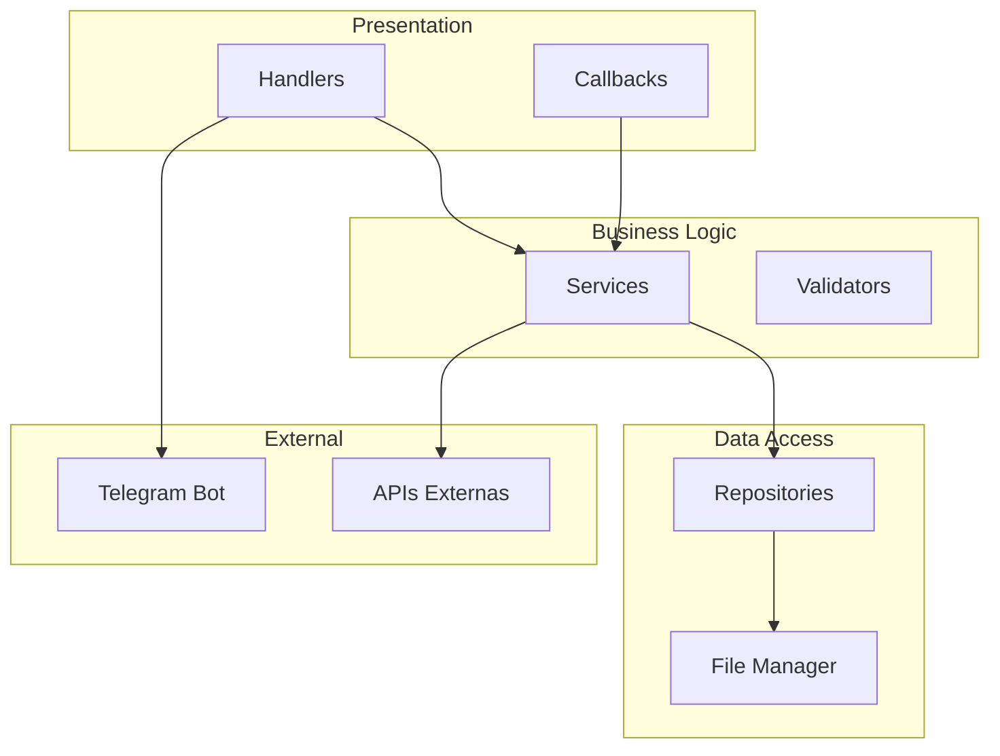

# Plan de Acción: Mejora y Refactorización de BitBread Alert

## Resumen Ejecutivo

Este plan detalla las acciones necesarias para detectar y corregir errores de código, implementar buenas prácticas y dar una estructura más profesional al proyecto BitBread Alert.

---

## Issues Identificadas

### 🔴 CRÍTICOS - Errores de Código

#### Issue #1: Funciones Duplicadas en handlers/weather.py
**Prioridad:** Alta | **Categoría:** Bug

**Descripción:**
El archivo [`handlers/weather.py`](handlers/weather.py) contiene múltiples definiciones de las mismas funciones, lo que causa comportamiento impredecible.

**Funciones afectadas:**
- [`get_current_weather()`](handlers/weather.py:74) - Definida localmente Y importada de `utils/weather_api`
- [`get_forecast()`](handlers/weather.py:89) - Definida localmente Y importada
- [`get_uv_index()`](handlers/weather.py:103) - Definida localmente Y importada
- [`get_air_quality()`](handlers/weather.py:113) - Definida localmente Y importada
- [`geocode_location()`](handlers/weather.py:147) - Definida DOS veces en el mismo archivo (líneas 147 y 153)

**Solución:**
- Eliminar las definiciones locales duplicadas
- Usar únicamente las funciones importadas de `utils/weather_api.py`

---

#### Issue #2: Dependencias Duplicadas en requirements.txt
**Prioridad:** Media | **Categoría:** Bug

**Descripción:**
El archivo [`requirements.txt`](requirements.txt) contiene dependencias duplicadas que pueden causar conflictos.

**Duplicados detectados:**
- `requests` - líneas 3 y 13
- `beautifulsoup4` - líneas 17 y 20

**Solución:**
```txt
# requirements.txt corregido
python-telegram-bot
python-telegram-bot[job-queue]
requests
requests[socks]
python-dotenv
openpyxl
Babel
Pillow
pytz
pandas 
pandas_ta
tradingview-ta
feedparser
chardet
aiohttp 
beautifulsoup4 
lxml
brotli
psutil
loguru
```

---

#### Issue #3: Tipos Incorrectos en ADMIN_CHAT_IDS
**Prioridad:** Alta | **Categoría:** Bug

**Descripción:**
En [`core/config.py:14`](core/config.py:14), los ADMIN_CHAT_IDS se almacenan como strings en lugar de integers.

```python
# Código actual (problemático)
ADMIN_CHAT_IDS = [id.strip() for id in ADMIN_CHAT_IDS_STR.split(',')] if ADMIN_CHAT_IDS_STR else []
```

**Problema:**
Esto causa comparaciones inconsistentes como `str(chat_id) not in ADMIN_CHAT_IDS` en todo el código.

**Solución:**
```python
ADMIN_CHAT_IDS = [int(id.strip()) for id in ADMIN_CHAT_IDS_STR.split(',')] if ADMIN_CHAT_IDS_STR else []
```

---

### 🟡 MEDIOS - Problemas de Estructura

#### Issue #4: Imports Circulares Potenciales
**Prioridad:** Media | **Categoría:** Architecture

**Descripción:**
Existe una dependencia circular potencial entre:
- [`utils/file_manager.py`](utils/file_manager.py) importa de `core.config`
- [`core/i18n.py`](core/i18n.py) importa de `utils.file_manager`

**Diagrama del problema:**


**Solución:**
- Crear un módulo `core/constants.py` para constantes puras
- Mover `get_user_language()` a un servicio separado

---

#### Issue #5: Sistema de Logging Inconsistente
**Prioridad:** Media | **Categoría:** Code Quality

**Descripción:**
El proyecto utiliza tres métodos diferentes de logging:
1. `print()` - Usado en varios lugares
2. `logger.info()` - Loguru logger
3. `add_log_line()` - Sistema personalizado

**Ubicaciones problemáticas:**
- [`handlers/weather.py:86`](handlers/weather.py:86) - `print(f"Error clima actual: {e}")`
- [`core/api_client.py:179`](core/api_client.py:179) - `print(f"Error obteniendo High/Low...")`
- [`utils/file_manager.py:451`](utils/file_manager.py:451) - `print(f"DEBUG: Usuario...")`

**Solución:**
- Estandarizar usando únicamente el logger de loguru
- Configurar handlers apropiados para diferentes niveles

---

#### Issue #6: Falta de Type Hints
**Prioridad:** Media | **Categoría:** Code Quality

**Descripción:**
La mayoría de las funciones carecen de anotaciones de tipo, dificultando el mantenimiento y el análisis estático.

**Ejemplo actual:**
```python
def obtener_precios_alerta():
    return _obtener_precios(["BTC", "TON", "HIVE", "HBD"], CMC_API_KEY_ALERTA)
```

**Solución esperada:**
```python
from typing import Dict, Optional

def obtener_precios_alerta() -> Optional[Dict[str, float]]:
    return _obtener_precios(["BTC", "TON", "HIVE", "HBD"], CMC_API_KEY_ALERTA)
```

---

### 🟢 BAJOS - Mejoras de Buenas Prácticas

#### Issue #7: Falta de Tests
**Prioridad:** Baja | **Categoría:** Testing

**Descripción:**
No existe carpeta de tests ni configuración de testing.

**Solución:**
Crear estructura de tests:
```
tests/
├── __init__.py
├── conftest.py
├── test_api_client.py
├── test_file_manager.py
├── test_handlers/
│   ├── test_weather.py
│   └── test_admin.py
└── test_utils/
    └── test_weather_api.py
```

---

#### Issue #8: Configuración de Proyecto Incompleta
**Prioridad:** Baja | **Categoría:** Infrastructure

**Descripción:**
Faltan archivos de configuración modernos de Python.

**Archivos necesarios:**
- `pyproject.toml` - Configuración moderna del proyecto
- `setup.cfg` - Configuración de herramientas
- `.pre-commit-config.yaml` - Hooks de pre-commit
- `pytest.ini` o configuración en pyproject.toml

---

#### Issue #9: Variables Globales Excesivas
**Prioridad:** Media | **Categoría:** Architecture

**Descripción:**
El código hace uso extensivo de variables globales, dificultando el testing y la mantenibilidad.

**Variables globales identificadas:**
- [`_USUARIOS_CACHE`](utils/file_manager.py:17)
- [`CUSTOM_ALERT_HISTORY`](core/loops.py:35)
- [`PRECIOS_CONTROL_ANTERIORES`](core/loops.py:34)
- [`_enviar_mensaje_telegram_async_ref`](core/loops.py:24)

**Solución:**
Implementar patrón de inyección de dependencias o usar clases para encapsular estado.

---

#### Issue #10: Manejo de Errores Inconsistente
**Prioridad:** Media | **Categoría:** Code Quality

**Descripción:**
El manejo de excepciones es inconsistente en todo el proyecto.

**Patrones encontrados:**
```python
# Patrón 1: Pass silencioso (malo)
except Exception:
    pass

# Patrón 2: Print sin contexto
except Exception as e:
    print(f"Error: {e}")

# Patrón 3: Logger correcto
except Exception as e:
    logger.error(f"Error: {e}")
```

**Solución:**
Estandarizar el manejo de errores usando el logger y proporcionando contexto adecuado.

---

## Arquitectura Propuesta

### Estructura de Directorios Mejorada

```
bbalert/
├── src/
│   └── bbalert/
│       ├── __init__.py
│       ├── main.py                 # Punto de entrada
│       ├── core/
│       │   ├── __init__.py
│       │   ├── config.py           # Configuración
│       │   ├── constants.py        # Constantes puras
│       │   └── exceptions.py       # Excepciones personalizadas
│       ├── handlers/
│       │   ├── __init__.py
│       │   └── ...
│       ├── services/               # NUEVO: Lógica de negocio
│       │   ├── __init__.py
│       │   ├── user_service.py
│       │   ├── alert_service.py
│       │   └── weather_service.py
│       ├── repositories/           # NUEVO: Acceso a datos
│       │   ├── __init__.py
│       │   ├── user_repository.py
│       │   └── alert_repository.py
│       └── utils/
│           └── ...
├── tests/
│   └── ...
├── data/
├── docs/
├── pyproject.toml
├── requirements.txt
└── README.md
```

### Diagrama de Arquitectura



---

## Plan de Implementación

### Fase 1: Corrección de Errores Críticos
1. ✅ Issue #1: Eliminar funciones duplicadas en weather.py
2. ✅ Issue #2: Limpiar requirements.txt
3. ✅ Issue #3: Corregir tipos en ADMIN_CHAT_IDS

### Fase 2: Mejoras de Calidad de Código
4. Issue #5: Estandarizar sistema de logging
5. Issue #6: Añadir type hints progresivamente
6. Issue #10: Mejorar manejo de errores

### Fase 3: Refactorización Arquitectónica
7. Issue #4: Resolver imports circulares
8. Issue #9: Reducir variables globales
9. Implementar estructura de servicios

### Fase 4: Infraestructura y Testing
10. Issue #7: Crear suite de tests
11. Issue #8: Configurar pyproject.toml
12. Configurar CI/CD

---

## Checklist de Implementación

### Fase 1 - Errores Críticos
- [ ] Eliminar funciones duplicadas en `handlers/weather.py`
- [ ] Limpiar `requirements.txt`
- [ ] Corregir `ADMIN_CHAT_IDS` en `core/config.py`
- [ ] Verificar que el bot funciona tras cambios

### Fase 2 - Calidad de Código
- [ ] Reemplazar `print()` por `logger`
- [ ] Añadir type hints a `core/api_client.py`
- [ ] Añadir type hints a `utils/file_manager.py`
- [ ] Añadir type hints a handlers principales
- [ ] Estandarizar manejo de excepciones

### Fase 3 - Arquitectura
- [ ] Crear `core/constants.py`
- [ ] Crear módulo `services/`
- [ ] Crear módulo `repositories/`
- [ ] Refactorizar variables globales

### Fase 4 - Infraestructura
- [ ] Crear `pyproject.toml`
- [ ] Crear `tests/` con tests básicos
- [ ] Configurar pre-commit hooks
- [ ] Documentar API con docstrings

---

## Próximos Pasos

1. **Revisar y aprobar** este plan de acción
2. **Priorizar** las issues según necesidades inmediatas
3. **Crear branches** para cada fase de trabajo
4. **Implementar** cambios de forma incremental
5. **Testear** cada cambio antes de mergear

---

*Documento generado el 2026-02-24*
*Autor: Kilo Code - Architect Mode*
