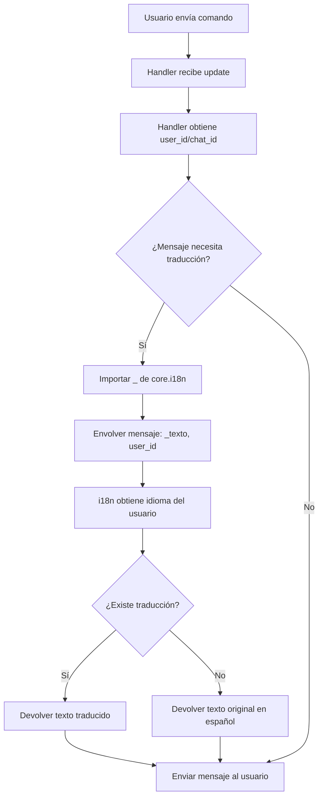

# Plan de Implementación: Sistema de Traducción para Mensajes del Bot

## Resumen Ejecutivo

Este plan describe la implementación de la función de traducción `_()` de `core/i18n.py` en todos los mensajes del bot que actualmente no la utilizan. El objetivo es que todos los textos visibles por el usuario puedan traducirse según su idioma configurado.

---

## Análisis del Sistema de Traducción Actual

### Función de Traducción (`core/i18n.py`)

La función de traducción funciona de la siguiente manera:

```python
from core.i18n import _

# Uso básico con chat_id
mensaje = _("Texto a traducir", chat_id)
```

**Parámetros:**
- `message: str` - El texto a traducir (en español, idioma base)
- `chat_id: int` - El ID del chat/usuario para obtener su idioma configurado

**Comportamiento:**
1. Si se proporciona `chat_id`, obtiene el idioma del usuario desde `get_user_language(chat_id)`
2. Busca la traducción en los archivos `.mo` de `locales/<idioma>/LC_MESSAGES/`
3. Si no encuentra traducción, devuelve el texto original (español)

### Archivos que YA usan traducción

| Archivo | Estado |
|---------|--------|
| `handlers/admin.py` | ✅ Parcialmente traducido |
| `handlers/alerts.py` | ✅ Traducido |
| `handlers/general.py` | ✅ Traducido |
| `handlers/user_settings.py` | ✅ Parcialmente traducido |
| `handlers/tasa.py` | ✅ Parcialmente traducido |
| `handlers/trading.py` | ✅ Importa `_` pero no lo usa |
| `handlers/ta.py` | ✅ Importa `_` pero no lo usa |
| `handlers/btc_handlers.py` | ✅ Importa `_` pero no lo usa |
| `handlers/weather.py` | ✅ Importa `_` pero no lo usa |
| `handlers/year_handlers.py` | ✅ Importa `_` pero no lo usa |
| `handlers/pay.py` | ✅ Importa `_` pero no lo usa |
| `handlers/valerts_handlers.py` | ✅ Importa `_` pero no lo usa |

### Archivos que NO usan traducción

| Archivo | Estado |
|---------|--------|
| `handlers/reminders.py` | ❌ No importa `_` |
| `core/year_loop.py` | ❌ No usa traducción |
| `core/weather_loop_v2.py` | ❌ No usa traducción |
| `core/reminders_loop.py` | ❌ No usa traducción |
| `core/global_disasters_loop.py` | ❌ No usa traducción |

---

## Issues Detallados para GitHub

### Issue #1: Implementar traducción en handlers/reminders.py

**Título:** `i18n: Agregar función de traducción a handlers/reminders.py`

**Descripción:**
El archivo `handlers/reminders.py` contiene múltiples mensajes de usuario que no utilizan la función de traducción. Esto impide que los usuarios vean los mensajes de recordatorios en su idioma configurado.

**Mensajes identificados sin traducir:**

| Línea | Mensaje Actual | Acción |
|-------|----------------|--------|
| 18 | `"📭 *No tienes recordatorios pendientes.*"` | Envolver con `_()` |
| 20 | `"📋 *Tus Recordatorios:*\n\n"` | Envolver con `_()` |
| 26 | `"➕ Nuevo Recordatorio"` | Envolver con `_()` |
| 27 | `"🗑 Eliminar"` | Envolver con `_()` |
| 28 | `"🔄 Actualizar"` | Envolver con `_()` |
| 61 | `"📝 *¿Qué quieres recordar?*\n\nEscribe el mensaje del recordatorio (o /cancel para salir)."` | Envolver con `_()` |
| 69-77 | Mensaje de formatos de tiempo | Envolver con `_()` |
| 157 | `"⚠️ La fecha indicada ya pasó. Por favor, indica una fecha futura."` | Envolver con `_()` |
| 166 | `"✅ *Recordatorio guardado.*\n\n📅 {msg_dt}\n📝 {text}"` | Envolver con `_()` |
| 171 | `"⚠️ No entendí la hora/fecha. Prueba formato: `DD/MM HH:MM` o `10m`."` | Envolver con `_()` |
| 176 | `"⚠️ Error procesando la fecha. Intenta de nuevo."` | Envolver con `_()` |
| 180 | `"❌ Operación cancelada."` | Envolver con `_()` |
| 202 | `"🗑 *Selecciona para eliminar:*"` | Envolver con `_()` |
| 216 | `"🗑 *No quedan recordatorios para eliminar.*"` | Envolver con `_()` |
| 267 | `"✅ Pospuesto {mins}m.\nNueva hora: {new_time.strftime('%H:%M')}"` | Envolver con `_()` |
| 271 | `"✅ *Recordatorio completado.*"` | Envolver con `_()` |

**Pasos de implementación:**
1. Agregar import: `from core.i18n import _`
2. Obtener `user_id` en cada función que envía mensajes
3. Envolver cada mensaje con `_("mensaje", user_id)`
4. Para mensajes con variables, usar `.format()` después de la traducción

**Ejemplo de cambio:**
```python
# Antes
msg = "📭 *No tienes recordatorios pendientes.*"

# Después
msg = _("📭 *No tienes recordatorios pendientes.*", user_id)
```

**Etiquetas:** `i18n`, `enhancement`, `handlers`

---

### Issue #2: Implementar traducción en handlers/year_handlers.py

**Título:** `i18n: Agregar función de traducción a handlers/year_handlers.py`

**Descripción:**
El archivo `handlers/year_handlers.py` tiene mensajes hardcodeados que no se traducen.

**Mensajes identificados sin traducir:**

| Línea | Mensaje Actual | Acción |
|-------|----------------|--------|
| 30 | `"❌ Escribe una frase más larga. Uso: `/y add Tu frase aquí`"` | Envolver con `_()` |
| 34 | `"✅ Frase añadida a la colección del año."` | Envolver con `_()` |
| 36 | `"⚠️ Esa frase ya existe."` | Envolver con `_()` |

**Pasos de implementación:**
1. El archivo ya importa `_` pero no lo usa
2. Obtener `user_id` en cada función
3. Envolver mensajes con `_()`

**Etiquetas:** `i18n`, `enhancement`, `handlers`

---

### Issue #3: Implementar traducción en handlers/btc_handlers.py

**Título:** `i18n: Agregar función de traducción a handlers/btc_handlers.py`

**Descripción:**
El archivo importa `_` pero tiene mensajes sin traducir.

**Mensajes identificados sin traducir:**

| Línea | Mensaje Actual | Acción |
|-------|----------------|--------|
| 138 | `"⚠️ Error obteniendo datos de Binance."` | Envolver con `_()` |

**Pasos de implementación:**
1. Obtener `user_id` en la función
2. Envolver el mensaje con `_()`

**Etiquetas:** `i18n`, `enhancement`, `handlers`

---

### Issue #4: Implementar traducción en handlers/ta.py

**Título:** `i18n: Agregar función de traducción a handlers/ta.py`

**Descripción:**
El archivo importa `_` pero tiene varios mensajes sin traducir.

**Mensajes identificados sin traducir:**

| Línea | Mensaje Actual | Acción |
|-------|----------------|--------|
| 279 | `f"⏳ _Analizando {full_symbol} ({timeframe})..._"` | Envolver con `_()` |
| 551 | `"❌ Error: No se pudo leer el reporte en pantalla."` | Envolver con `_()` |
| 588 | `"⚠️ La IA está ocupada, intenta de nuevo."` | Envolver con `_()` |

**Pasos de implementación:**
1. Obtener `user_id` en cada función
2. Envolver mensajes con `_()` usando variables con `.format()`

**Etiquetas:** `i18n`, `enhancement`, `handlers`

---

### Issue #5: Implementar traducción en handlers/admin.py (mensajes restantes)

**Título:** `i18n: Completar traducción en handlers/admin.py`

**Descripción:**
El archivo ya usa traducción parcialmente, pero quedan mensajes sin traducir, especialmente en el comando `/ad` y `/users`.

**Mensajes identificados sin traducir:**

| Línea | Mensaje Actual | Acción |
|-------|----------------|--------|
| 362 | `"❌ No estás registrado."` | Envolver con `_()` |
| 421 | `"⏳ *Analizando Big Data...*"` | Envolver con `_()` |
| 757 | `"📭 No hay anuncios activos.\nUsa `/ad add Mi Anuncio` para crear uno."` | Envolver con `_()` |
| 760 | `"📢 *Lista de Anuncios Activos:*\n\n"` | Envolver con `_()` |
| 765 | `"\nPara borrar: `/ad del N` (ej: `/ad del 1`)"` | Envolver con `_()` |
| 771-776 | Mensajes de fallback de Markdown | Envolver con `_()` |
| 785 | `"⚠️ Escribe el texto del anuncio.\nEj: `/ad add Visita mi canal @canal`"` | Envolver con `_()` |
| 793 | `f"✅ Anuncio añadido:\n\n_{texto_nuevo}_"` | Envolver con `_()` |
| 796 | `f"✅ Anuncio añadido (Sintaxis MD inválida, mostrado plano):\n\n{texto_nuevo}"` | Envolver con `_()` |
| 806 | `f"🗑️ Anuncio eliminado:\n\n_{eliminado}_"` | Envolver con `_()` |
| 809 | `f"🗑️ Anuncio eliminado:\n\n{eliminado}"` | Envolver con `_()` |
| 811 | `"⚠️ Número de anuncio no válido."` | Envolver con `_()` |
| 813 | `"⚠️ Uso: `/ad del N` (N es el número del anuncio)."` | Envolver con `_()` |
| 816 | `"⚠️ Comandos: `/ad`, `/ad add <txt>`, `/ad del <num>`"` | Envolver con `_()` |

**Etiquetas:** `i18n`, `enhancement`, `handlers`

---

### Issue #6: Implementar traducción en handlers/user_settings.py (mensajes restantes)

**Título:** `i18n: Completar traducción en handlers/user_settings.py`

**Descripción:**
El archivo tiene algunos mensajes sin traducir.

**Mensajes identificados sin traducir:**

| Línea | Mensaje Actual | Acción |
|-------|----------------|--------|
| 308 | `"⚠️ El precio debe ser un número válido."` | Envolver con `_()` |
| 319 | `"⚠️ Para editar usa: `/hbdalerts edit <precio> run` o `stop`."` | Envolver con `_()` |

**Etiquetas:** `i18n`, `enhancement`, `handlers`

---

### Issue #7: Implementar traducción en core/year_loop.py

**Título:** `i18n: Agregar función de traducción a core/year_loop.py`

**Descripción:**
El loop de año nuevo envía mensajes a usuarios sin traducir.

**Mensajes identificados sin traducir:**

| Línea | Mensaje Actual | Acción |
|-------|----------------|--------|
| 31 | `msg = get_detailed_year_message()` | El mensaje necesita traducción |

**Pasos de implementación:**
1. Importar `_` de `core.i18n`
2. Modificar `get_detailed_year_message()` para aceptar `user_id`
3. Envolver el mensaje con `_()`

**Etiquetas:** `i18n`, `enhancement`, `core`

---

### Issue #8: Implementar traducción en core/weather_loop_v2.py

**Título:** `i18n: Agregar función de traducción a core/weather_loop_v2.py`

**Descripción:**
El loop de clima envía alertas meteorológicas sin traducir.

**Mensajes identificados sin traducir:**

| Línea | Mensaje Actual | Acción |
|-------|----------------|--------|
| 271 | `text` (mensaje de alerta climática) | Necesita traducción |

**Pasos de implementación:**
1. Importar `_` de `core.i18n`
2. Envolver los mensajes de alerta con `_()`

**Etiquetas:** `i18n`, `enhancement`, `core`

---

### Issue #9: Implementar traducción en core/reminders_loop.py

**Título:** `i18n: Agregar función de traducción a core/reminders_loop.py`

**Descripción:**
El loop de recordatorios envía mensajes sin traducir.

**Pasos de implementación:**
1. Importar `_` de `core.i18n`
2. Identificar mensajes enviados a usuarios
3. Envolver con `_()`

**Etiquetas:** `i18n`, `enhancement`, `core`

---

### Issue #10: Implementar traducción en core/global_disasters_loop.py

**Título:** `i18n: Agregar función de traducción a core/global_disasters_loop.py`

**Descripción:**
El loop de desastres globales envía alertas sin traducir.

**Pasos de implementación:**
1. Importar `_` de `core.i18n`
2. Identificar mensajes enviados a usuarios
3. Envolver con `_()`

**Etiquetas:** `i18n`, `enhancement`, `core`

---

### Issue #11: Actualizar archivos de traducción (locales)

**Título:** `i18n: Actualizar archivos .po con nuevos mensajes traducibles`

**Descripción:**
Después de implementar la función `_()` en todos los archivos, es necesario:

1. Ejecutar `pybabel extract` para extraer todos los mensajes nuevos
2. Actualizar los archivos `.po` existentes
3. Traducir los nuevos mensajes al inglés
4. Compilar los archivos `.mo`

**Comandos a ejecutar:**
```bash
# Extraer mensajes
pybabel extract -o locales/bbalert.pot .

# Actualizar traducciones existentes
pybabel update -i locales/bbalert.pot -d locales -l en
pybabel update -i locales/bbalert.pot -d locales -l es

# Compilar traducciones
pybabel compile -d locales
```

**Etiquetas:** `i18n`, `localization`, `locales`

---

## Diagrama de Flujo de Traducción



---

## Estimación de Complejidad

| Issue | Complejidad | Prioridad |
|-------|-------------|-----------|
| #1 handlers/reminders.py | Media | Alta |
| #2 handlers/year_handlers.py | Baja | Media |
| #3 handlers/btc_handlers.py | Baja | Media |
| #4 handlers/ta.py | Baja | Media |
| #5 handlers/admin.py | Media | Alta |
| #6 handlers/user_settings.py | Baja | Media |
| #7 core/year_loop.py | Media | Baja |
| #8 core/weather_loop_v2.py | Media | Baja |
| #9 core/reminders_loop.py | Media | Baja |
| #10 core/global_disasters_loop.py | Media | Baja |
| #11 Actualizar locales | Alta | Alta |

---

## Notas Importantes

1. **No modificar la función de traducción**: La función `_()` en `core/i18n.py` funciona correctamente y no debe modificarse.

2. **Obtener user_id correctamente**: En callbacks usar `query.from_user.id`, en mensajes usar `update.effective_user.id`.

3. **Mensajes con variables**: Usar `.format()` después de la traducción:
   ```python
   # Correcto
   mensaje = _("Hola {nombre}", user_id).format(nombre=nombre)
   
   # Incorrecto
   mensaje = _(f"Hola {nombre}", user_id)  # La variable se evalúa antes de traducir
   ```

4. **Probar en ambos idiomas**: Después de implementar, probar con usuarios en español e inglés.

---

## Checklist de Implementación

- [ ] Issue #1: handlers/reminders.py
- [ ] Issue #2: handlers/year_handlers.py
- [ ] Issue #3: handlers/btc_handlers.py
- [ ] Issue #4: handlers/ta.py
- [ ] Issue #5: handlers/admin.py
- [ ] Issue #6: handlers/user_settings.py
- [ ] Issue #7: core/year_loop.py
- [ ] Issue #8: core/weather_loop_v2.py
- [ ] Issue #9: core/reminders_loop.py
- [ ] Issue #10: core/global_disasters_loop.py
- [ ] Issue #11: Actualizar archivos locales
- [ ] Testing completo en español
- [ ] Testing completo en inglés
