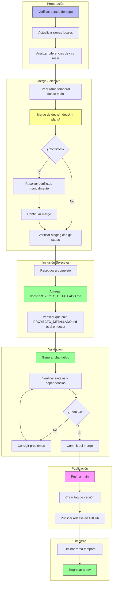

#
# Plan: Merge Selectivo de dev a main (con documentación pública)
#
## Resumen

Este plan describe el proceso para pasar el código de la rama `dev` a `main`,
incluyendo la documentación pública (`docs/PROYECTO_DETALLADO.md`) pero excluyendo
la documentación interna de desarrollo (`docs/sk_*.md`, `plans/`, etc.).

**Objetivo**: Dejar en `main` solo los directorios, documentos y código necesarios
para que el bot funcione y los usuarios puedan entenderlo. Los usuarios que clonen
el repositorio público necesitan:
- Código funcional
- README.md (guía rápida)
- PROYECTO_DETALLADO.md (documentación técnica completa)

**NO necesitan**:
- Skills de desarrollo (`docs/sk_*.md`)
- Planes internos (`plans/`)
- Directorios de trabajo (`docs/WebApp/`)

> ⚠️ **Antes de empezar**: Asegúrate de que tu working tree esté limpio (`git status`).
> Si tienes cambios sin commitear en `dev`, guárdalos con `git stash` antes de continuar.

-----

## Qué se incluye vs Qué se excluye

### ✅ Incluir en main

| Archivo/Directorio | Propósito |
|-------------------|-----------|
| Código fuente (`*.py`) | Funcionalidad del bot |
| `README.md` | Guía de usuario rápida |
| `docs/PROYECTO_DETALLADO.md` | Documentación técnica completa |
| Archivos de configuración | `apit.env.example`, `requirements.txt`, etc. |
| `data-example/` | Datos de ejemplo para usuarios |
| `locales/` | Traducciones (i18n) |
| `scripts/`, `systemd/` | Scripts de deploy |
| `tests/` | Tests (código de producción) |
| `LICENSE`, `CHANGELOG.md` | Licencia e historial |

### ❌ Excluir de main (mantener solo en dev)

| Archivo/Directorio | Propósito | ¿Por qué excluir? |
|-------------------|-----------|-------------------|
| `docs/sk_*.md` | Skills de desarrollo | Documentación interna del proceso |
| `docs/WebApp/` | Directorio de trabajo | Vacío o en desarrollo |
| `plans/` | Planes y especificaciones | Proceso interno de desarrollo |
| Borradores y WIP | Trabajo en progreso | No listo para producción |

-----

## Estructura Final de main

```
main/
├── .gitignore
├── .github/
├── LICENSE
├── CHANGELOG.md
├── README.md                    # Guía de usuario
├── docs/
│   └── PROYECTO_DETALLADO.md   # Documentación técnica completa
├── apit.env.example
├── babel.cfg
├── bbalert.py
├── mbot.sh
├── requirements.txt
├── version.txt.example
├── core/                        # Código fuente
├── handlers/                    # Comandos
├── utils/                       # Utilidades
├── locales/                     # Traducciones
├── data-example/               # Datos de ejemplo
├── scripts/                     # Scripts auxiliares
├── systemd/                     # Configuración systemd
└── tests/                       # Tests
```

-----

## Diagrama del Flujo de Trabajo



-----

## Paso 1: Verificar Estado del Repositorio

```bash
# Confirmar que estás en dev y el working tree está limpio
git branch --show-current
git status

# Si hay cambios sin commitear, guardarlos temporalmente
# git stash

# Actualizar referencias remotas
git fetch --all

# Ver commits de dev que aún no están en main
git log main..dev --oneline

# Ver archivos afectados entre ramas
git diff --name-status main..dev
```

### Verificación esperada

- La rama `dev` debe existir local y en el remoto
- Debe haber commits en `dev` que no están en `main`
- El archivo `docs/PROYECTO_DETALLADO.md` debe estar presente en dev

-----

## Paso 2: Merge Selectivo con Documentación Pública

### Estrategia Principal (Recomendada)

Esta estrategia incluye automáticamente `docs/PROYECTO_DETALLADO.md` mientras
excluye el resto de documentación interna.

```bash
# 1. Situarse en main actualizado
git checkout main
git pull origin main

# 2. Crear rama temporal de trabajo
git checkout -b merge-dev-to-main

# 3. Traer cambios de dev SIN hacer commit automático
git merge dev --no-commit --no-ff

# 4. Resetear TODO el directorio docs/ (sacar del staging)
git reset HEAD docs/ 2>/dev/null || true

# 5. Resetear el directorio plans/ (sacar del staging)
git reset HEAD plans/ 2>/dev/null || true

# 6. Restaurar docs/ al estado de main (elimina archivos nuevos de dev)
git checkout -- docs/ 2>/dev/null || true

# 7. Agregar EXPLÍCITAMENTE solo PROYECTO_DETALLADO.md
git add docs/PROYECTO_DETALLADO.md

# 8. Verificar que el staging es correcto ANTES de commitear
echo "=== Archivos en staging ==="
git diff --cached --name-only

echo ""
echo "=== Verificando docs/ ==="
git diff --cached --name-only | grep "^docs/" || echo "⚠️ Ningún archivo de docs/ en staging"

# 9. Commit del merge
git commit -m "merge: dev a main v$(cat version.txt 2>/dev/null || echo 'X.X.X')

Incluye:
- Código fuente actualizado (core/, handlers/, utils/)
- README.md con documentación de usuario
- docs/PROYECTO_DETALLADO.md (documentación técnica completa)
- Configuraciones y dependencias actualizadas
- Tests y scripts de deploy

Excluye:
- docs/sk_*.md (skills de desarrollo internos)
- docs/WebApp/ (directorios de trabajo)
- plans/ (planes de desarrollo internos)"
```

> 💡 **Si aparecen conflictos en el paso 3**, Git lo indicará. Resuélvelos manualmente
> (edita los archivos marcados con `<<<<<<<`), luego haz `git add <archivo>` por cada uno
> y continúa desde el paso 4.

-----

## Paso 3: Verificación Pre-Commit

### Checklist Importante

Antes de hacer commit, verifica:

- [ ] `docs/PROYECTO_DETALLADO.md` **SÍ** está en el staging
- [ ] `docs/sk_*.md` **NO** están en el staging
- [ ] `docs/WebApp/` **NO** está en el staging
- [ ] `plans/` **NO** está en el staging
- [ ] Código fuente (`core/`, `handlers/`, `utils/`) está actualizado
- [ ] `README.md` está actualizado
- [ ] `requirements.txt` está actualizado (si aplica)

### Comandos de Verificación

```bash
# Ver todos los archivos en staging
echo "=== Archivos que se incluirán en main ==="
git diff --cached --name-only | sort

# Verificar docs/ específicamente
echo ""
echo "=== Archivos de docs/ en staging ==="
git diff --cached --name-only | grep "^docs/" || echo "⚠️ Ningún archivo de docs/ en staging"

# Verificar que PROYECTO_DETALLADO.md está incluido
echo ""
echo "=== Verificando PROYECTO_DETALLADO.md ==="
git diff --cached --name-only | grep "docs/PROYECTO_DETALLADO.md" \
  && echo "✅ PROYECTO_DETALLADO.md incluido correctamente" \
  || echo "❌ ERROR: PROYECTO_DETALLADO.md NO está en el staging"

# Verificar que NO hay archivos no deseados en docs/
echo ""
echo "=== Verificando archivos no deseados ==="
UNWANTED=$(git diff --cached --name-only | grep -E "^docs/(sk_|WebApp)" || true)
if [ -n "$UNWANTED" ]; then
    echo "❌ ERROR: Archivos no deseados en docs/:"
    echo "$UNWANTED"
else
    echo "✅ No hay archivos de desarrollo en docs/"
fi

# Verificar que plans/ NO está incluid
o
PLANS=$(git diff --cached --name-only | grep "^plans/" || true)
if [ -n "$PLANS" ]; then
    echo "❌ ERROR: plans/ está en el staging:"
    echo "$PLANS"
else
    echo "✅ plans/ excluido correctamente"
fi
```

-----

## Paso 4: Validación Técnica

```bash
# Sintaxis Python
python -m py_compile bbalert.py
python -m py_compile core/*.py
python -m py_compile handlers/*.py
python -m py_compile utils/*.py

echo "✅ Sintaxis Python OK"

# Verificar que PROYECTO_DETALLADO.md existe y tiene contenido
if [ -f "docs/PROYECTO_DETALLADO.md" ]; then
    LINES=$(wc -l < docs/PROYECTO_DETALLADO.md)
    echo "✅ PROYECTO_DETALLADO.md existe ($LINES líneas)"
else
    echo "❌ ERROR: PROYECTO_DETALLADO.md no encontrado"
fi
```

-----

## Paso 5: Publicar en main

```bash
# 1. Fusionar la rama temporal en main
git checkout main
git merge merge-dev-to-main --ff-only

# 2. Push a main
git push origin main

# 3. Crear tag de versión
VERSION=$(cat version.txt 2>/dev/null || echo "1.0.0")
git tag -a "v$VERSION" -m "Release v$VERSION

Cambios incluidos:
- Código fuente actualizado
- Documentación de usuario (README.md)
- Documentación técnica completa (PROYECTO_DETALLADO.md)
- Configuraciones y dependencias"

git push origin "v$VERSION"

# 4. Opcional: Crear release en GitHub (si usas gh CLI)
# gh release create "v$VERSION" --title "v$VERSION" --notes-file CHANGELOG.md
```

> 💡 Usa `--ff-only` en el merge final para garantizar un historial limpio.

-----

## Paso 6: Verificación Post-Publicación

```bash
# Confirmar que main tiene los commits esperados
echo "=== Últimos commits en main ==="
git log origin/main -3 --oneline

# Verificar que docs/ existe en main
echo ""
echo "=== Verificando docs/ en main ==="
git ls-tree -d origin/main --name-only | grep "^docs$" \
  && echo "✅ docs/ existe en main" \
  || echo "⚠️ docs/ NO existe en main"

# Verificar contenido de docs/
echo ""
echo "=== Contenido de docs/ en main ==="
git ls-tree -r origin/main --name-only | grep "^docs/"

# Verificar que solo PROYECTO_DETALLADO.md está en docs/
echo ""
echo "=== Verificación de exclusión ==="
DOCS_COUNT=$(git ls-tree -r origin/main --name-only | grep -c "^docs/" || echo "0")
PROYECTO_COUNT=$(git ls-tree -r origin/main --name-only | grep -c "docs/PROYECTO_DETALLADO.md" || echo "0")

if [ "$DOCS_COUNT" -eq "$PROYECTO_COUNT" ] && [ "$DOCS_COUNT" -eq 1 ]; then
    echo "✅ docs/ contiene SOLO PROYECTO_DETALLADO.md"
else
    echo "⚠️ docs/ contiene $DOCS_COUNT archivo(s). Verificar manualmente."
fi

# Verificar que plans/ NO está en main
echo ""
echo "=== Verificando plans/ ==="
git ls-tree -d origin/main --name-only | grep "^plans$" \
  && echo "⚠️ ERROR: plans/ encontrado en main" \
  || echo "✅ plans/ no está en main"

# Comparar main vs dev (solo para referencia)
echo ""
echo "=== Diferencias main vs dev (ignorando docs y plans) ==="
git diff origin/main origin/dev --stat ':!docs' ':!plans' | head -20
```

-----

## Paso 7: Limpieza y Retorno a dev

```bash
# Eliminar rama temporal local
git branch -d merge-dev-to-main

# Eliminar rama temporal remota (si fue pusheada por error)
git push origin --delete merge-dev-to-main 2>/dev/null || true

# Regresar a dev para continuar el desarrollo
git checkout dev

# Si habías guardado cambios con stash, recuperarlos
# git stash pop
```

> **Regla de oro**: Nunca trabajes directamente en `main`. Vuelve a `dev` inmediatamente tras el merge.

-----

## Secuencia Completa (Copia Rápida)

```bash
# === PREPARACIÓN ===
git fetch --all
git checkout main
git pull origin main

# === MERGE SELECTIVO ===
git checkout -b merge-dev-to-main
git merge dev --no-commit --no-ff

# Excluir docs/ y plans/ completamente
git reset HEAD docs/ 2>/dev/null || true
git reset HEAD plans/ 2>/dev/null || true
git checkout -- docs/ 2>/dev/null || true
git checkout -- plans/ 2>/dev/null || true

# Incluir SOLO PROYECTO_DETALLADO.md
git add docs/PROYECTO_DETALLADO.md

# Verificar antes de commit
git diff --cached --name-only
git diff --cached --name-only | grep "docs/PROYECTO_DETALLADO.md"

# Commit
git commit -m "merge: dev a main v$(cat version.txt)"

# === PUBLICACIÓN ===
git checkout main
git merge merge-dev-to-main --ff-only
git push origin main

VERSION=$(cat version.txt)
git tag -a "v$VERSION" -m "Release v$VERSION"
git push origin "v$VERSION"

# === LIMPIEZA ===
git branch -d merge-dev-to-main
git checkout dev
```

-----

## Rollback

Si algo sale mal después del push:

```bash
# Opción A: Revertir el último merge (crea un commit de reversión)
git checkout main
git revert -m 1 HEAD
git push origin main

# Opción B: Resetear al commit anterior (más agresivo, requiere --force)
# git reset --hard HEAD~1
# git push --force-with-lease origin main
```

> Prefiere **Opción A** si hay otros colaboradores. La Opción B reescribe el historial.

-----

## Resumen de Inclusión/Exclusión

| Ubicación | ¿Incluir en main? | Archivos |
|-----------|-------------------|----------|
| `README.md` | ✅ SÍ | Guía de usuario |
| `docs/PROYECTO_DETALLADO.md` | ✅ SÍ | Documentación técnica completa |
| `docs/sk_*.md` | ❌ NO | Skills de desarrollo interno |
| `docs/WebApp/` | ❌ NO | Directorios de trabajo |
| `plans/` | ❌ NO | Planes de desarrollo |
| Código fuente | ✅ SÍ | `core/`, `handlers/`, `utils/` |
| Configuración | ✅ SÍ | `requirements.txt`, etc. |
| Tests | ✅ SÍ | `tests/` |

### Flujo de Trabajo Recomendado

1. **Desarrollo**: Trabajar siempre en `dev` o ramas `feature/`
2. **Documentación pública**: Actualizar `README.md` y `docs/PROYECTO_DETALLADO.md`
3. **Documentación interna**: Skills y planes solo en `dev`
4. **Merge a main**: Usar este plan (incluye automáticamente PROYECTO_DETALLADO.md)
5. **Release**: Crear tags y releases desde `main`
6. **Nunca**: Commitear directamente en `main`
