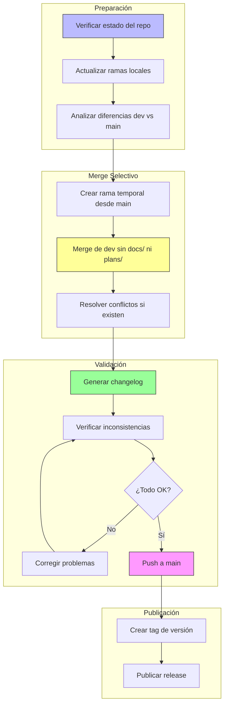

# Plan: Merge Selectivo de dev a main (sin docs/ ni plans/)

## Resumen

Este plan describe el proceso para pasar el código de la rama `dev` a `main`, excluyendo los directorios `docs/` y `plans/`, publicar los cambios y verificar que no existan inconsistencias.

**Objetivo**: Dejar en `main` solo los directorios, documentos y código necesarios para que el bot funcione. Los usuarios que clonen el repositorio público solo necesitan el código funcional, no el proceso de desarrollo.

## Directorios Excluidos de main

| Directorio | Propósito | ¿Por qué excluirlo de main? |
|------------|-----------|----------------------------|
| `docs/` | Documentación de desarrollo | Documentación interna del proceso de desarrollo |
| `plans/` | Planes y especificaciones | Planes de desarrollo, no necesarios para ejecutar el bot |

## Estructura Final de main (Lo que debe quedar)

```
main/
├── .gitignore
├── ads.json
├── apit.env.example
├── babel.cfg
├── bbalert.py
├── LICENSE
├── mbot.sh
├── README.md
├── requirements.txt
├── tree.md
├── update_version.py
├── version.txt
├── .github/
├── core/
├── data-example/
├── handlers/
├── locales/
├── scripts/
├── systemd/
└── utils/
```

## Diagrama del Flujo de Trabajo



---

## Paso 1: Verificar Estado del Repositorio

### Comandos a ejecutar

```bash
# Verificar rama actual
git branch --show-current

# Verificar ramas remotas disponibles
git branch -r

# Actualizar referencias remotas
git fetch --all

# Ver diferencias entre dev y main
git log main..dev --oneline

# Ver archivos modificados entre ramas
git diff --name-status main..dev
```

### Verificación esperada
- La rama `dev` debe existir en el remoto
- Debe haber commits en `dev` que no están en `main`
- Los directorios `docs/` y `plans/` deben aparecer en las diferencias

---

## Paso 2: Estrategia para Excluir docs/ y plans/

### Opción A: Merge con .gitignore temporal (Recomendada)

Esta es la estrategia más limpia para excluir `docs/` y `plans/`:

```bash
# 1. Crear rama temporal desde main
git checkout main
git pull origin main
git checkout -b merge-dev-to-main

# 2. Hacer merge de dev pero NO hacer commit automático
git merge dev --no-commit --no-ff

# 3. Remover los directorios docs/ y plans/ del staging
git reset HEAD docs/
git reset HEAD plans/

# 4. Asegurar que docs/ y plans/ no se incluyan
git checkout -- docs/
git checkout -- plans/

# 5. Verificar qué se va a commitear
git status

# 6. Hacer el commit del merge
git commit -m "merge: dev a main (sin docs/ ni plans/)"
```

### Opción B: Cherry-pick de commits específicos

Si solo hay ciertos commits que quieres incluir:

```bash
# 1. Ver commits de dev que no están en main
git log main..dev --oneline

# 2. Crear rama temporal
git checkout main
git checkout -b merge-dev-to-main

# 3. Cherry-pick cada commit (excluyendo los de docs/ y plans/)
git cherry-pick <commit-hash-1>
git cherry-pick <commit-hash-2>
# ... repetir para cada commit necesario
```

### Opción C: Merge con estrategia personalizada

```bash
# 1. Configurar merge driver para excluir docs/ y plans/
git checkout main
git checkout -b merge-dev-to-main

# 2. Merge con estrategia ours para docs/ y plans/
git merge dev -X ours --no-commit
git checkout dev -- . ':!docs/' ':!plans/'

# 3. Commit del merge
git commit -m "merge: dev a main (sin docs/ ni plans/)"
```

---

## Paso 3: Generar Changelog

Usando el skill `changelog-generator`, se generará un changelog profesional basado en los commits:

```bash
# Ver commits que serán parte del changelog
git log main..dev --oneline --no-merges
```

### Categorías para el Changelog

| Categoría | Prefijo de Commit |
|-----------|-------------------|
| ✨ Nuevas funcionalidades | `feat:` |
| 🔧 Mejoras | `improve:`, `refactor:` |
| 🐛 Correcciones | `fix:` |
| 📚 Documentación | `docs:` |
| 🔒 Seguridad | `security:` |
| 🚀 Deploy/Infra | `deploy:`, `infra:` |

---

## Paso 4: Verificar Inconsistencias

### Checklist de Verificación

- [ ] **Sintaxis Python**: Verificar que no hay errores de sintaxis
- [ ] **Imports**: Verificar que todos los imports son válidos
- [ ] **Dependencias**: Verificar que `requirements.txt` está actualizado
- [ ] **Configuración**: Verificar archivos de configuración
- [ ] **Tests**: Ejecutar tests si existen
- [ ] **Variables de entorno**: Verificar `.env.example`

### Comandos de Verificación

```bash
# Verificar sintaxis Python
python -m py_compile bbalert.py
python -m py_compile core/*.py
python -m py_compile handlers/*.py
python -m py_compile utils/*.py

# Verificar imports (si está instalado)
pip install pyflakes
pyflakes bbalert.py core/*.py handlers/*.py utils/*.py

# Verificar dependencias
pip install -r requirements.txt --dry-run

# Verificar estructura de archivos
ls -la core/ handlers/ utils/ locales/
```

---

## Paso 5: Publicar en main

### Comandos de Publicación

```bash
# 1. Cambiar a main
git checkout main

# 2. Merge de la rama temporal
git merge merge-dev-to-main

# 3. Push a main
git push origin main

# 4. Crear tag de versión (opcional)
VERSION=$(cat version.txt)
git tag -a "v$VERSION" -m "Release v$VERSION"
git push origin "v$VERSION"

# 5. Eliminar rama temporal
git branch -d merge-dev-to-main
git push origin --delete merge-dev-to-main 2>/dev/null || true
```

---

## Paso 6: Verificación Post-Publicación

### Validaciones Finales

```bash
# Verificar que main está actualizado
git log origin/main -5 --oneline

# Verificar que docs/ NO existe en main
git ls-tree -d origin/main --name-only | grep docs || echo "docs/ no existe en main ✓"

# Verificar que plans/ NO existe en main
git ls-tree -d origin/main --name-only | grep plans || echo "plans/ no existe en main ✓"

# Verificar que el código coincide con lo esperado
git diff origin/main origin/dev --stat ':!docs' ':!plans'
```

---

## Resumen de Comandos (Secuencia Completa)

```bash
# === PREPARACIÓN ===
git fetch --all
git checkout main
git pull origin main

# === MERGE SELECTIVO ===
git checkout -b merge-dev-to-main
git merge dev --no-commit --no-ff
git reset HEAD docs/
git reset HEAD plans/
git checkout -- docs/ 2>/dev/null || true
git checkout -- plans/ 2>/dev/null || true
git status
git commit -m "merge: dev a main (sin docs/ ni plans/)"

# === VERIFICACIÓN ===
python -m py_compile bbalert.py
# ... más verificaciones

# === PUBLICACIÓN ===
git checkout main
git merge merge-dev-to-main
git push origin main

# === LIMPIEZA ===
git branch -d merge-dev-to-main
```

---

## Notas Importantes

1. **Backup**: Antes de ejecutar, asegúrate de tener un backup o estar seguro de poder revertir cambios
2. **Conflictos**: Si hay conflictos durante el merge, resolverlos manualmente antes de continuar
3. **Tests**: Si el proyecto tiene tests, ejecutarlos antes del push final
4. **Comunicación**: Notificar al equipo antes de hacer cambios en main
5. **Directorios de desarrollo**: `docs/` y `plans/` son directorios de desarrollo que solo deben existir en `dev`

---

## Rollback (si algo sale mal)

```bash
# Revertir el merge si hay problemas
git checkout main
git revert -m 1 HEAD
git push origin main
```

---

## Mantenimiento Continuo

### Regla de Oro para main

El repositorio `main` debe contener **solo** lo necesario para que el bot funcione:

| Incluir en main | Excluir de main |
|-----------------|-----------------|
| Código fuente (`*.py`) | Documentación de desarrollo (`docs/`) |
| Archivos de configuración | Planes y especificaciones (`plans/`) |
| Archivos de datos de ejemplo | Archivos de desarrollo temporales |
| README.md (guía de usuario) | Notas de desarrollo internas |
| LICENSE | Borradores y WIP |
| requirements.txt | |
| Scripts de deploy | |
| Configuración systemd | |

### Flujo de Trabajo Recomendado

1. **Desarrollo**: Trabajar siempre en `dev` o ramas feature
2. **Documentación**: Crear planes y docs en `docs/` y `plans/` (solo en dev)
3. **Merge a main**: Usar merge selectivo excluyendo `docs/` y `plans/`
4. **Release**: Crear tags y releases desde main
