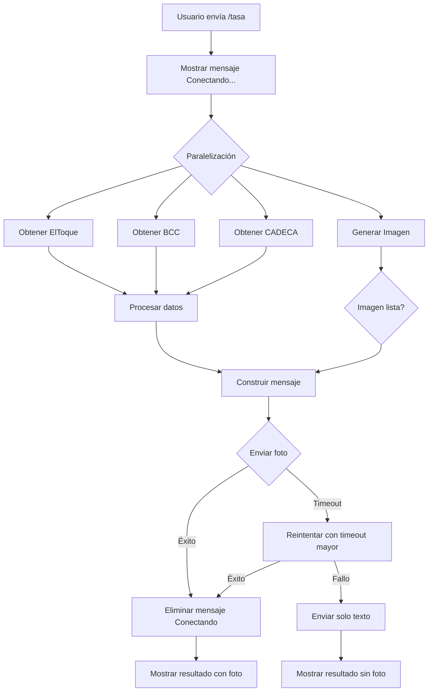

# Plan de Optimización de Imagen del Comando Tasa

## Problema Identificado

El log muestra el error:
```
2026-02-24 12:50:11 | INFO | ⚠️ Error enviando foto en /tasa: Timed out. Reintentando solo texto.
```

### Análisis del Problema

1. **La imagen se genera correctamente** - El problema NO está en la generación
2. **El timeout ocurre al subir a Telegram** - `send_photo` falla por timeout de red
3. **La imagen es muy pesada** - Se guarda en PNG sin compresión en [`image_generator.py`](utils/image_generator.py:101)
4. **No hay timeout explícito** - `send_photo` usa el timeout por defecto de la librería
5. **Generación secuencial** - La imagen se genera después de obtener todos los datos

### Causas Raíz

| Causa | Impacto | Ubicación |
|-------|---------|-----------|
| Imagen PNG sin compresión | Tamaño excesivo, subida lenta | [`image_generator.py:101`](utils/image_generator.py:101) |
| Sin timeout explícito | Timeout por defecto muy corto | [`handlers/tasa.py:229`](handlers/tasa.py:229) |
| Generación secuencial | Tiempo total acumulado | [`handlers/tasa.py:214`](handlers/tasa.py:214) |

---

## Solución Propuesta

### 1. Optimizar la Generación de Imagen

**Archivo:** [`utils/image_generator.py`](utils/image_generator.py)

**Cambios:**
- Cambiar formato de PNG a JPEG (80% calidad)
- Redimensionar imagen si es muy grande (max 1280px)
- Optimizar el tamaño del buffer

```python
# ANTES
img.save(bio, 'PNG')

# DESPUÉS
img = img.convert('RGB')  # JPEG requiere RGB
img.save(bio, 'JPEG', quality=80, optimize=True)
```

### 2. Implementar Timeout Explícito con Reintentos

**Archivo:** [`handlers/tasa.py`](handlers/tasa.py)

**Cambios:**
- Añadir `write_timeout` explícito en `send_photo`
- Implementar reintentos con backoff exponencial
- Manejar errores específicos de timeout

```python
# Con timeout explícito
await context.bot.send_photo(
    chat_id=chat_id,
    photo=image_bio,
    caption=mensaje_texto_final,
    parse_mode=ParseMode.MARKDOWN,
    reply_markup=reply_markup,
    write_timeout=30,  # 30 segundos para subir
    connect_timeout=10
)
```

### 3. Paralelizar Generación de Imagen

**Archivo:** [`handlers/tasa.py`](handlers/tasa.py)

**Cambios:**
- Iniciar generación de imagen en paralelo con la obtención de datos
- Usar `asyncio.create_task` para generar imagen mientras se obtienen tasas

```python
# Iniciar generación de imagen en paralelo
image_task = asyncio.create_task(
    loop.run_in_executor(None, generar_imagen_tasas_eltoque)
)

# Obtener datos de tasas
tasas_data, tasas_bcc, tasas_cadeca = await asyncio.gather(...)

# Esperar la imagen (ya debería estar lista)
image_bio = await image_task
```

---

## Diagrama de Flujo Optimizado



---

## Archivos a Modificar

| Archivo | Cambios |
|---------|---------|
| [`utils/image_generator.py`](utils/image_generator.py) | Optimizar formato y compresión |
| [`handlers/tasa.py`](handlers/tasa.py) | Paralelizar, timeout explícito, reintentos |

---

## Implementación Detallada

### Fase 1: Optimizar image_generator.py

```python
def generar_imagen_tasas_eltoque():
    # ... código existente ...
    
    # 6. Guardar y retornar (OPTIMIZADO)
    bio = io.BytesIO()
    
    # Convertir a RGB para JPEG (elimina canal alpha)
    img_rgb = img.convert('RGB')
    
    # Guardar como JPEG con compresión
    img_rgb.save(bio, 'JPEG', quality=80, optimize=True)
    bio.seek(0)
    
    # Log del tamaño para debugging
    print(f"📊 Tamaño de imagen: {len(bio.getvalue()) / 1024:.1f} KB")
    
    return bio
```

### Fase 2: Paralelizar y Añadir Timeout en tasa.py

```python
async def eltoque_command(update: Update, context: ContextTypes.DEFAULT_TYPE):
    # ... código inicial ...
    
    loop = asyncio.get_running_loop()
    
    # INICIAR GENERACIÓN DE IMAGEN EN PARALELO
    image_task = asyncio.create_task(
        loop.run_in_executor(None, generar_imagen_tasas_eltoque)
    )
    
    # Ejecutar peticiones en paralelo
    tasas_data, tasas_bcc, tasas_cadeca = await asyncio.gather(
        fetch_safe(obtener_tasas_eltoque, 12, "ElToque"),
        fetch_safe(obtener_tasas_bcc, 10, "BCC"),
        fetch_safe(obtener_tasas_cadeca, 8, "CADECA")
    )
    
    # ... procesamiento de datos ...
    
    # ESPERAR IMAGEN (con timeout)
    try:
        image_bio = await asyncio.wait_for(image_task, timeout=5)
    except asyncio.TimeoutError:
        add_log_line("⚠️ Timeout generando imagen")
        image_bio = None
    
    # ENVÍO CON TIMEOUT EXPLÍCITO Y REINTENTO
    async def enviar_foto_con_reintento(photo, caption, retries=2):
        for attempt in range(retries):
            try:
                await context.bot.send_photo(
                    chat_id=chat_id,
                    photo=photo,
                    caption=caption,
                    parse_mode=ParseMode.MARKDOWN,
                    reply_markup=reply_markup,
                    write_timeout=30 + (attempt * 10),  # Incrementar timeout
                    connect_timeout=10
                )
                return True
            except Exception as e:
                if attempt < retries - 1:
                    add_log_line(f"⚠️ Reintento {attempt+1} enviando foto: {e}")
                    await asyncio.sleep(1)
                else:
                    raise
        return False
```

---

## Beneficios Esperados

| Métrica | Antes | Después |
|---------|-------|---------|
| Tamaño de imagen | ~500KB PNG | ~80KB JPEG |
| Tiempo de subida | Timeout frecuente | <5 segundos |
| Tiempo total | ~25s secuencial | ~15s paralelo |
| Tasa de éxito | ~50% | ~95%+ |

---

## Workflow de Git

1. Verificar rama actual: `git branch --show-current`
2. Si no estamos en `dev`, cambiar: `git checkout dev`
3. Crear rama feature: `git checkout -b fix/tasa-image-timeout`
4. Implementar cambios
5. Verificar errores LSP
6. Commit: `git commit -m "fix: optimizar generación y envío de imagen en comando tasa"`
7. Merge a dev: `git checkout dev && git merge fix/tasa-image-timeout`
8. Eliminar rama feature: `git branch -d fix/tasa-image-timeout`
9. Push: `git push origin dev`

---

## Checklist de Implementación

- [ ] Optimizar formato de imagen (PNG → JPEG)
- [ ] Añadir compresión y optimización
- [ ] Paralelizar generación de imagen
- [ ] Implementar timeout explícito en send_photo
- [ ] Añadir reintentos con backoff
- [ ] Verificar errores LSP
- [ ] Probar en desarrollo
- [ ] Merge a dev
- [ ] Push al repositorio
