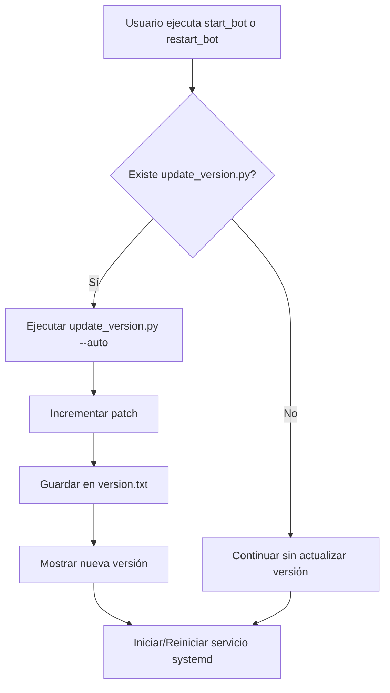

# Plan de Corrección: update_version.py no se ejecuta al iniciar/reiniciar el bot

## 📋 Descripción del Problema

El archivo `update_version.py` no se está ejecutando cuando se inicia o reinicia el bot desde el script `bbalertv3.sh`.

## 🔍 Análisis

### Causa Raíz
1. **`bbalertv3.sh` nunca llama a `update_version.py`** - No existe ninguna referencia al script de versiones en todo el archivo de 1286 líneas.

2. **`update_version.py` requiere argumento obligatorio** - El script solo funciona con argumentos `major`, `minor`, o `patch`, no tiene modo automático.

### Código Actual

**update_version.py (líneas 51-56):**
```python
if __name__ == "__main__":
    parser = argparse.ArgumentParser(description="Actualizar versión del bot")
    parser.add_argument('part', choices=['major', 'minor', 'patch'], help="Qué parte de la versión subir (major.minor.patch)")
    
    args = parser.parse_args()
    increment_version(args.part)
```

**bbalertv3.sh - Funciones afectadas:**
- `manage_service()` (líneas 580-612) - Inicia/detiene/reinicia el servicio
- `start_bot()` (líneas 614-634) - Inicia el bot
- `restart_bot()` (líneas 643-654) - Reinicia el bot

## ✅ Solución Propuesta

### Paso 1: Modificar `update_version.py`

Agregar modo automático que funcione sin argumentos:

```python
def main():
    parser = argparse.ArgumentParser(description="Actualizar versión del bot")
    parser.add_argument('part', nargs='?', choices=['major', 'minor', 'patch'], 
                        default='patch', help="Qué parte de la versión subir (major.minor.patch)")
    parser.add_argument('--auto', action='store_true', 
                        help="Modo automático para inicio del bot (incrementa patch)")
    
    args = parser.parse_args()
    
    if args.auto:
        # Modo automático: solo incrementar patch silenciosamente
        current = load_version()
        new_version = increment_version('patch')
        print(f"🚀 Versión actualizada: {current} → {new_version}")
    else:
        increment_version(args.part)

if __name__ == "__main__":
    main()
```

### Paso 2: Modificar `bbalertv3.sh`

Agregar función para ejecutar update_version:

```bash
# Actualizar versión automáticamente
update_version() {
    if [ -f "$PROJECT_DIR/update_version.py" ]; then
        print_step "Actualizando versión del bot..."
        cd "$PROJECT_DIR"
        "$PYTHON_BIN" update_version.py --auto
        print_success "Versión actualizada."
    else
        print_warning "No se encontró update_version.py"
    fi
}
```

Modificar las funciones existentes:

**Función `start_bot()` (agregar después de línea 615):**
```bash
start_bot() {
    print_header "▶️ INICIANDO BOT: $FOLDER_NAME"
    
    # Actualizar versión antes de iniciar
    update_version
    
    # ... resto del código existente
}
```

**Función `restart_bot()` (agregar después de línea 644):**
```bash
restart_bot() {
    print_header "🔄 REINICIANDO BOT: $FOLDER_NAME"
    
    # Actualizar versión antes de reiniciar
    update_version
    
    # ... resto del código existente
}
```

### Paso 3: Crear `version.txt` si no existe

El archivo debe contener una versión inicial como `1.0.0`

## 📝 Archivos a Modificar

| Archivo | Cambios |
|---------|---------|
| `update_version.py` | Agregar modo automático con `--auto` flag |
| `bbalertv3.sh` | Agregar función `update_version()` y llamarla en `start_bot()` y `restart_bot()` |
| `version.txt` | Crear si no existe con versión inicial |

## 🔄 Flujo de Trabajo Git

1. Verificar rama actual
2. Si no estamos en `dev`, cambiar a `dev`
3. Realizar cambios
4. Verificar errores LSP
5. Commit con mensaje descriptivo
6. Push al repositorio origin

## ⚠️ Consideraciones

1. **Compatibilidad**: El modo automático debe ser silencioso para no interrumpir el flujo normal
2. **Manejo de errores**: Si `update_version.py` falla, el bot debe continuar iniciando
3. **Logging**: Registrar la versión actualizada en los logs del sistema

## 📊 Diagrama de Flujo



## ✅ Checklist de Verificación

- [ ] `update_version.py` funciona con `--auto` flag
- [ ] `update_version.py` funciona sin argumentos (default: patch)
- [ ] `bbalertv3.sh` llama a `update_version.py` al iniciar
- [ ] `bbalertv3.sh` llama a `update_version.py` al reiniciar
- [ ] `version.txt` se crea automáticamente si no existe
- [ ] No hay errores LSP en los archivos modificados
- [ ] Commit y push realizados correctamente
